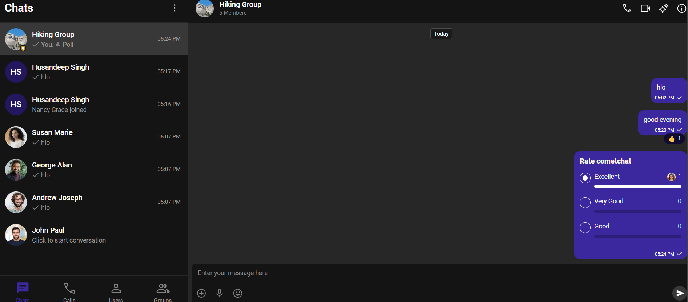
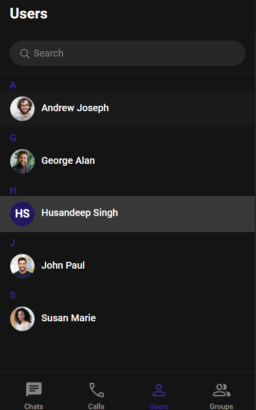
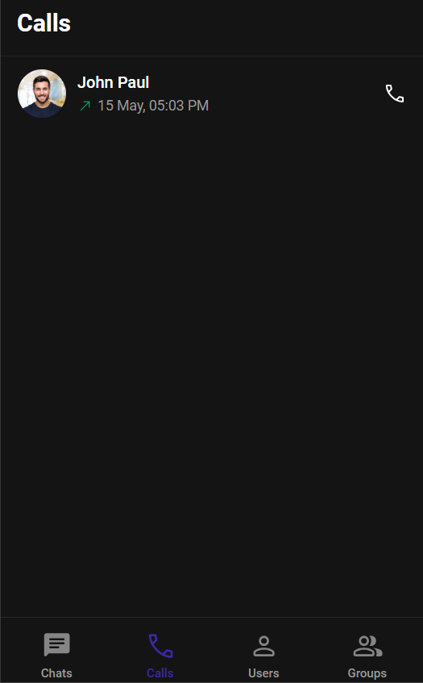
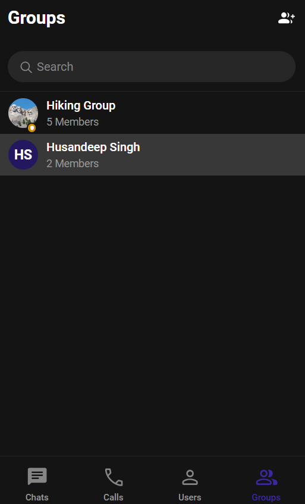

# CometChat Internship Assignment – React UI Kit Integration

This is a fully functional React-based chat application built using CometChat’s UI Kit (Visual Builder). It allows users to log in and chat in real time with other users created in the CometChat dashboard.

##  Tech Stack

- React
- CometChat Pro SDK (UI Kit)
- JavaScript (ES6+)
- HTML/CSS

##  Features

- Login screen with UID authentication
- Real-time one-on-one messaging
- UI powered by CometChat React UI Kit
- Responsive and styled out of the box
- CometChat cloud handles all backend logic

##  Screenshots

<p>CHAT</p>
 <br><br>
<p>USERS</p>
<br><br>
<p>CALLS</p>
<br><br>
<p>GROUPS</p>

  
## 🛠️ How to Run Locally

1. Clone the repository:
   ```bash
   git clone https://github.com/your-username/cometchat-assignment.git
   cd cometchat-assignment
   ```

2. Install dependencies:
   ```bash
   npm install
   ```

3. Start the development server:
   ```bash
   npm start
   ```

4. Login with any UID created in your CometChat dashboard (e.g., `user1`, `user2`)

## 🔑 CometChat Credentials

Stored in `src/constants.js`:
```javascript
export const COMETCHAT_CONSTANTS = {
  APP_ID: "275545190c4ca01f",
  REGION: "in",
  AUTH_KEY: "32a765aeecc246b7f76aea6ff7c985eaf92d4b4e",
};
```

## ❗ Challenges Faced

- **No default users provided** — Had to manually create test UIDs like `user1`, `user2`
- **Limited Visual Builder docs** — Required back-and-forth with official UI Kit documentation
- **Confusion with Auth Keys** — Accidentally used the REST key initially instead of Auth key

## ✅ How I Solved Them

- Created test users in the CometChat dashboard
- Used CometChat’s official UI Kit setup tutorial
- Debugged login failures by printing `CometChat.login` errors in console

## 💡 Suggestions for CometChat

- Add default test users to all new apps automatically
- Include a visual example of where to plug UI Kit files into a React app
- Separate REST API key and Auth key more clearly in dashboard
